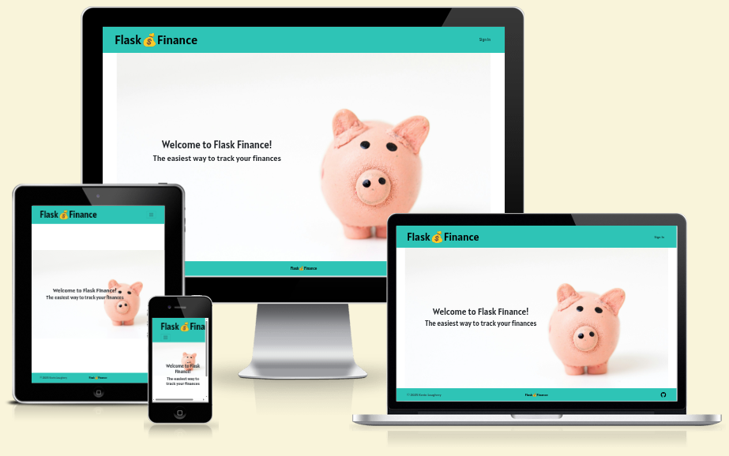

# FinanceApp

## Deployed Link

[Live Deployment on Render](https://financeapp-x3ki.onrender.com/)

## Features
* User registration with email confirmation, password resetting, etc.
* Users can create and categorise incomes and expenses.
* Users can view, edit, and delete expenses via a dashboard.
* Users can view graphs showing their finance category breakdowns via the dashboard.

## Tech Stack
* Flask: project backend
* flask-security-too: Accounts and registration
* Bootstrap: Frontend and layout
* Jinja2: HTML templating
* SQLAlchemy: ORM
* Postgres: Database
* Psycopg2: Database connector
* Pytest and Coverage: Automated tests
* Conventional Commits: Commit message style

## Methodology
The project was developed using an agile methodology with three defined sprints. User stories can be found [here](https://github.com/KevLoughrey/FinanceApp/issues?q=is%3Aissue%20state%3Aclosed). Sprint backlogs can be found [here](https://github.com/KevLoughrey/FinanceApp/milestones?state=closed). A kanban board was also maintained [here](https://github.com/users/KevLoughrey/projects/1).

## ToDo
* Additional work is required for responsiveness mobile and tablet devices
* Many of the manual E2E tests below can be automated

## Manual End to End Testing
### User Accounts
|Test case|Passing|
|---|---|
|A logged out user can not see profile links in the navbar|✅|
|A logged out user is redirected to the login page when trying to access /finances/dashboard|✅|
|A logged out user is redirected to the login page when trying to access /finances/add_income|✅|
|A logged out user is redirected to the login page when trying to access /finances/add_expense|✅|
|Upon entering a valid email address and password on the register screen, a confirmation link is sent to that email address|✅|
|A registered but unconfirmed user will be told they must confirm their email address before logging in, if they try to log in|✅|
|Clicking the link in the confirmation email confirms the user's account|✅|
|A registered and confirmed user is logged in when entering the correct password and email, and redirected to the homepage|✅|
|A logged in user is redirected to the homepage if they try to access /accounts/register|✅|
|A logged in user is redirected to the homepage if they try to access /accounts/login|✅|
|A logged in user is shown additional navigation links (Add Expense, Add Income, View Finances, and Sign Out) in the navbar|✅|
|A logged in user is logged out if they click the Sign Out link|✅|
|If a user visits accounts/reset and enters their email address, they receive an email with a link to reset their password|✅|
|If a user follows the link and enters a new password, they can then log in with this new password|✅|
|If a confirmed user visits accounts/confirm and submits their email address, they are told that their account has already been confirmed|✅|
|If an unconfirmed user visits accounts/confirm and enters their email address, the confirmation email is resent to them|✅|
|Attempting to login with an empty email address and/or password will result in a frontend warning ("Please fill out this field")|✅|
|Attempting to register with an empty email address and/or password will result in a frontend warning ("Please fill out this field")|✅|
|Attempting to register with an email address that is already in use will result in a message ("address is already associated with an account")|✅|
|Attempting to submit the reset password form with an empty email addresswill result in a frontend warning ("Please fill out this field")|✅|
|Attempting to submit the resend confirmation form with an empty email addresswill result in a frontend warning ("Please fill out this field")|✅|
|Attempting to register with an invalid password (less than 8 characters) will display a relevant message (password must be at least 8 characters)|✅|
### Expenses
|Test case|Passing|
|---|---|
|Selecting the Expenses tab on finances/dashboard loads a list of expense entries|✅|
|If no expense entries exist, the text "No expenses found." is displayed|✅|
|Clicking the Add Expense link in the navbar takes the user to finances/add_expense|✅|
|Attempting to submit an expense without a Date results in a warning popup and the form does not submit|✅|
|Attempting to submit an expense without a Name results in a warning popup and the form does not submit|✅|
|Attempting to submit an expense with a blank Amount results in a warning popup and the form does not submit|✅|
|Attempting to type alphabet characters in the Amount input fails|✅|
|Clicking Add Expense when the form is filled in correctly takes the user to finances/dashboard, where the newly created expense is visible|✅|
|Clicking the Edit button beside an expense in the dashboard puts it into Edit mode, replacing the text strings with input boxes|✅|
|Attempting to submit an edited expense without a Name results in a warning popup and the form does not submit|✅|
|Attempting to submit an edited expense without a Name results in a warning popup and the form does not submit|✅|
|Attempting to type alphabet characters in the edit Amount input fails|✅|
|Clicking the Checkmark beside an Edit mode expense updates the data and puts it back into Read mode, with the new data displayed|✅|
|Clicking the Cross (X) beside an Edit mode expense cances editing and puts it back into Read mode, with the existing data displayed|✅|
|Clicking the Bin icon beside a Read mode expense opens a modal, asking if the user wants to delete the expense|✅|
|Clicking cancel in this modal dismisses the modal and does nothing further|✅|
|Clicking delete in the modal dismisses the modal and deletes the expense|✅|

### Income
|Test case|Passing|
|---|---|
|Selecting the Income tab on finances/dashboard loads a list of income entries|✅|
|If no income entries exist, the text "No income found." is displayed|✅|
|Clicking the Add Income link in the navbar takes the user to finances/add_income|✅|
|Attempting to submit an income without a Date results in a warning popup and the form does not submit|✅|
|Attempting to submit an income without a Name results in a warning popup and the form does not submit|✅|
|Attempting to submit an income with a blank Amount results in a warning popup and the form does not submit|✅|
|Attempting to type alphabet characters in the Amount input fails|✅|
|Clicking Add Income when the form is filled in correctly takes the user to finances/dashboard, where the newly created income is visible|✅|
|Clicking the Edit button beside an income in the dashboard puts it into Edit mode, replacing the text strings with input boxes|✅|
|Attempting to submit an edited income without a Name results in a warning popup and the form does not submit|✅|
|Attempting to submit an edited income without a Name results in a warning popup and the form does not submit|✅|
|Attempting to type alphabet characters in the edit Amount input fails|✅|
|Clicking the Checkmark beside an Edit mode income updates the data and puts it back into Read mode, with the new data displayed|✅|
|Clicking the Cross (X) beside an Edit mode income cances editing and puts it back into Read mode, with the existing data displayed|✅|
|Clicking the Bin icon beside a Read mode income opens a modal, asking if the user wants to delete the income|✅|
|Clicking cancel in this modal dismisses the modal and does nothing further|✅|
|Clicking delete in the modal dismisses the modal and deletes the income|✅|

### Charts
|Test case|Passing|
|---|---|
|Selecting the Charts tab on finances/dashboard will show the user finance breakdown charts for all of their expenses and income|✅|
|Selecting a start month but not an end month and clicking filter will show the user all finances from the start month to the present day|✅|
|Selecting a start month and an end month and clicking filter will show the user all finances from those months (inclusive)|✅|